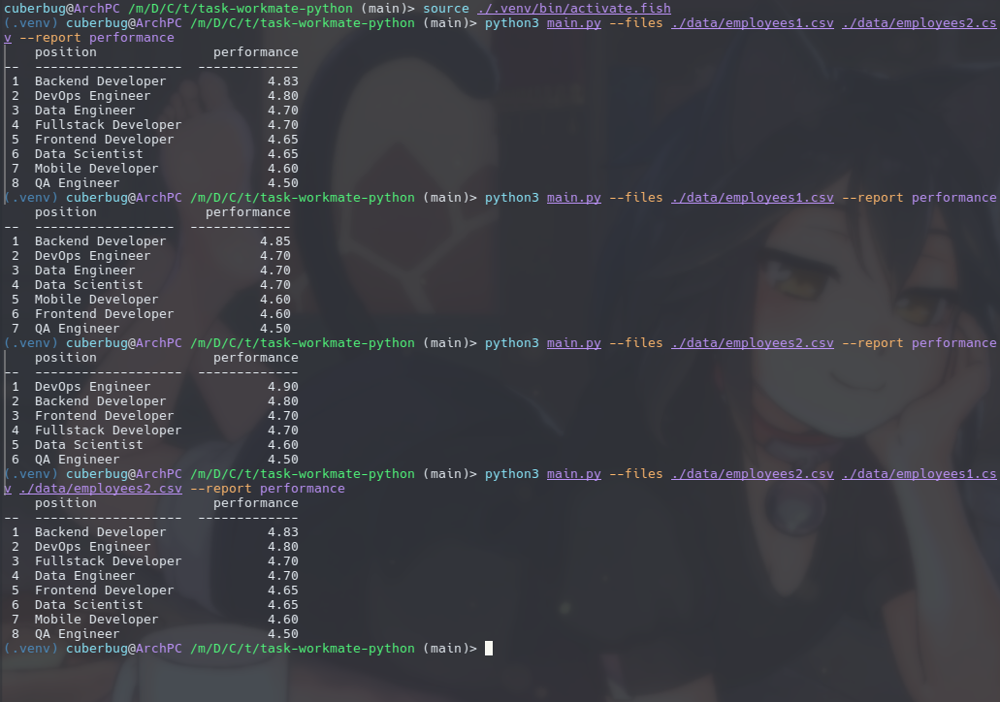
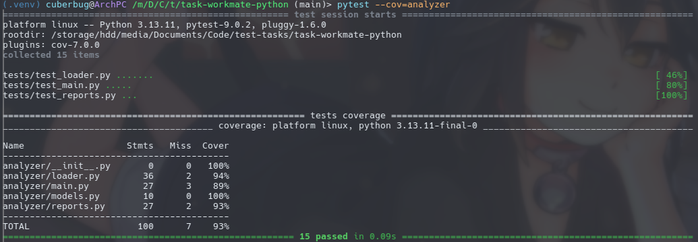

# task-workmate-python

Здесь находится [тестовое задание](./task/README.md) на вакансию **Backend-developer (Python)**.

Решение представляет собой приложеие, принимающее CSV-файлы с данными о сотрудниках и название отчёта, который следует предоставить. В ответе выводит таблицу для запрошенного отчёта. По заданию таким отчётом является `performance`, в котором для каждой позиции в компании посчитана средняя эффективность сотрудников, а вывод отсортирован по убыванию эффективности.

## Установка и запуск

### Зависимости

Для **Debian** и **Ubuntu** необходимо установить пакет `python3-venv` или его аналог, позволяющий полноценно управлять виртуальным окружением:

```shell
sudo apt install python3-venv
```

### Настройка виртуального окружения

В качестве пирмера настройки будет использоваться модуль `venv`, который в большинстве случаев входит в состав пакета `python3`.

Для установки виртуального окружения в директорию `.venv`, находясь в корне репозитория выполните:

```shell
python3 -m venv .venv
```

Затем активируйте его:

```shell
# Для bash и других POSIX-совместимых shell
source ./.venv/bin/activate

# Для fish:
source ./.venv/bin/activate.fish
```

После активации окружения нужно установить зависимости из `requirements.txt`:

```shell
pip install -r requirements.txt
```

### Запуск

Для запуска потребуется активированное и настроеннок виртуальное окружение и использование параметров:
* `--files`: путь до CSV-файла, может быть несколько через пробел. Может быть относительным.
* `--report`: название отчёта, в нашем случае — это `performance`.

Пример команды для запуска:

```shell
python3 main.py --files ./data/employees1.csv ./data/employees2.csv --report performance
```



## Тестирование

В соответствии с требованиями написаны тесты, покрывающие основной функционал приложения. Запустить их можно также из настроенного виртуального окружения:

```shell
pytest --cov=analyzer
```


