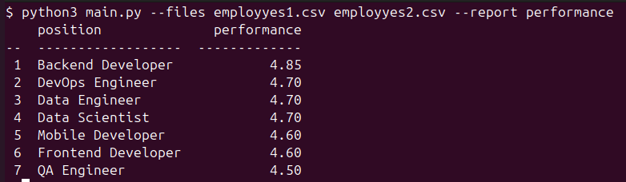

# Анализ эффективности работы разработчиков	

## Что нужно сделать?

**Нужно написать скрипт для обработки csv-файла.**

Скрипт читает файлы с данными (см. примеры ниже) о закрытых задачах и формирует отчеты. Нужно сформировать всего один отчёт `performance` (см. пример ниже). Отчёт включает в себя список позиция и среднюю эффективность (среднее арифметическое по колонке performance), отчёт сортируется по эффективности. Название файлов (может быть несколько) и название отчета передается в виде параметров `--files` и `--report` (см. пример ниже). Отчёт формируется по всем переданных файлам, а не по каждому отдельно.

Чтобы сфокусироваться на функционале формирования отчёта и не отвлекаться на рутинные задачи (обработку параметров скрипта, чтения файлов и вывод), можно использовать стандартную библиотеку argparse и csv, а для отображения в консоли — библиотеку tabulate.

##### Примеры файлов можно посмотреть [здесь](https://drive.google.com/drive/folders/1I3BhrDAyD8SbOt168aDxjnVCacAbmnfD?usp=sharing), выглядят так:

```csv
name,position,completed_tasks,performance,skills,team,experience_years  
Alex Ivanov,Backend Developer,45,4.8,"Python, Django, PostgreSQL, Docker",API Team,5  
Maria Petrova,Frontend Developer,38,4.7,"React, TypeScript, Redux, CSS",Web Team,4  
John Smith,Data Scientist,29,4.6,"Python, ML, SQL, Pandas",AI Team,3  
Anna Lee,DevOps Engineer,52,4.9,"AWS, Kubernetes, Terraform, Ansible",Infrastructure Team,6  
Mike Brown,QA Engineer,41,4.5,"Selenium, Jest, Cypress, Postman",Testing Team,4
```

##### Пример запуска скрипта:



## Какие функциональные требования?

* можно передать пути к файлам  
* можно указать название отчета   
* в консоль выводится отчёт в виде таблице

## Какие не функциональные требования?

* для всего кроме тестов и вывода в консоль, можно использовать только стандартную библиотеку, например:  
  * для обработки параметров скрипта нельзя использовать click, можно argparse  
  * для чтения файлов нельзя использовать pandas, но можно csv  
* в архитектуру заложена возможность добавления новых отчётов, например, если захотим посмотреть сколько сотрудников владеют нужной технологией, то отчет можно будет быстро добавить  
* код покрыт тестами написанными на pytest  
* для тестов можно использовать любые дополнительные библиотеки  
* код соответствует:  
  * общепринятым стандартам написания проектов на python  
  * общепринятому стилю

## Как сдавать задание?

* присылайте ссылку на git репозиторий, ссылки на google drive или yandex не подходят  
* присылайте примеры запуска скрипта, например:  
  * можно сделать скриншот запуска скрипта и добавить его репозиторий, для примера работы можно использовать [эти](https://drive.google.com/drive/folders/1I3BhrDAyD8SbOt168aDxjnVCacAbmnfD?usp=sharing) файлы. За приложенные примеры запуска ревьюер скажет вам спасибо и добавит баллы.  
* перед отправкой ссылки на репозиторий проверьте, пожалуйста, что репозиторий публичный и его можно посмотреть

## FAQ

* Можно ли использовать нейросети?  
  * Рекомендуем не использовать. Сталкиваемся со случаями, когда кандидаты увлекаются нейросетями, чтобы сделать тестовое, а потом не проходят техническое интервью, потому что не понимают, почему нейросеть написала тот или иной код.  
* Будет ли приниматься задание без тестов?  
  * Нет, приниматься не будет. Наличие тестов входит в основные требования.  
* Код покрыт тестами — это какой процент покрытия?  
  * Можно ориентироваться на 80% покрытия по pytest-cov, можно больше, можно меньше, но главное чтобы был протестирован критически важный функционал.  
* Можно ли использовать какие-то дополнительные библиотеки к pytest?  
  * Да, всё что помогает вам тестировать код можно использовать.  
* Можно ли пользоваться линтерами или форматтерами кода?  
  * Да, можно использовать любой линтер и любой форматтер — это хорошая практика.  
* Можно ли использовать что-то кроме pip для управления зависимостями?  
  * Да, можно, приветствуется.  
* Можно ли менять API, название и формат параметров скрипта?  
  * Нет, менять нельзя, используем `files` и `report`.  
* Нужно ли учитывать случаи, когда пользователь при запуске скрипта ввёл что-то не то?  
  * Да, нужно, считаем что содержимое файлов всегда валидно, но пользователь может запустить скрипт с любыми аргументами.  
* Нужно ли учитывать случаи, когда файл с данными большой, например несколько Гб?  
  * Нет, не нужно, ограничений по памяти нет, всё можно читать в память.  
* Нужно ли писать комментарии в коде?  
  * Если вы считаете что они нужны, то пишите.  
* На что будет смотреть ревьюер при проверки задания?  
  * Будет проверяться выполнение функциональных и нефункциональных требований, соблюдение общепринятых стандартов написания кода на python и архитектура, которая позволит добавлять новые отчёты.  
* Новые отчёты которые будут добавляться будут использовать тот же формат файлов?  
  * Да, формат будет такой же, новые колонки добавляться не будут.  
* Нужно ли писать readme.md?  
  * Да, но достаточно пары абзацев в несколько предложений. В него можно положить примеры запуска скрипта и написать то, что на ваш взгляд важно знать ревьюеру, например описание того как добавить новый отчет. Если будете писать readme, то пусть он будет небольшим, но по делу, чем большим  и сгенерированным нейросетью.
